# Azerbaijan Bank Branch Network Analysis

**Strategic Analysis for AzerTurk Bank**

A comprehensive data-driven analysis of the Azerbaijan banking market, focusing on branch network distribution, competitive positioning, and growth opportunities for AzerTurk Bank.

---

## 📊 Executive Summary

This analysis examines **585 bank branches** across **20 banks** in Azerbaijan, with a specific focus on AzerTurk Bank's market position and strategic expansion opportunities.

### Key Findings

- **AzerTurk Bank Position:** #11 out of 20 banks with 17 branches (2.91% market share)
- **Market Leader:** Kapital Bank with 177 branches (30.3% market share)
- **Gap to Leader:** 160 branches
- **Geographic Concentration:** ATB branches in Baku (needs recalculation for 17 branches)
- **Expansion Opportunities:** 198 high-potential locations identified
- **Competitive Intensity:** Average 108.3 competitors within 10km of each ATB branch

### Strategic Recommendations Priority

1. **Regional Expansion** (HIGH) - Increase presence outside Baku
2. **Data-Driven Location Selection** (HIGH) - Use growth opportunity heatmap
3. **Competitive Positioning** (MEDIUM) - Differentiation strategy
4. **Network Optimization** (LOW) - Performance audit of existing branches

---

## 🏦 Market Landscape

### Banks Analyzed (20 Total)

**Top 5 Banks:**
1. Kapital Bank - 177 branches (30.3%)
2. ABB Bank - 78 branches (13.3%)
3. Bank Respublika - 40 branches (6.8%)
4. Unibank - 36 branches (6.2%)
5. AccessBank - 35 branches (6.0%)

**Mid-Tier Banks:**
6. Rabita Bank - 31 branches
7. Xalq Bank - 31 branches
8. Yelo Bank - 22 branches
9. Turan Bank - 19 branches

**Smaller Banks:**
10. **AzerTurk Bank - 17 branches** ⭐ (Focus of analysis)
11-19. Express Bank (16), Ziraat Bank (10), Premium Bank (8), Yapi Kredi Bank (8), Pasha Bank (8), BTB (8), ASB Bank (7), AFB (7), VTB Bank (6)

---

## 📈 Detailed Chart Analysis

### Chart 1: Branch Count Comparison

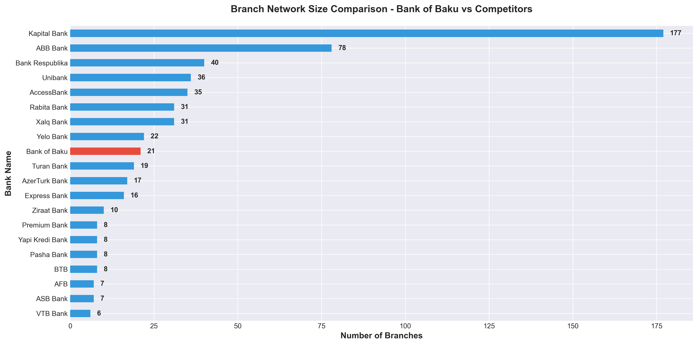

**What This Shows:**
Complete ranking of all 20 banks by total branch count, with AzerTurk Bank highlighted in red.

**Key Insights:**
- **Kapital Bank leads** with 177 branches (30.3% market share)
- **AzerTurk Bank ranks #11** with 17 branches (2.91% market share)
- **Top 3 banks** (Kapital, ABB, Bank Respublika) control 50.3% of the market
- **Gap to leader:** 160 branches (10.4× larger network)

**Actionable Insights:**
- ⚠️ **Market concentration risk:** Top 3 banks still dominate, but more competitors exist
- 💡 **Catch-up opportunity:** Growing from #11 to #5 requires 19 additional branches
- 🎯 **Realistic target:** Aim for 10% market share (58-59 branches) within 3 years

---

### Chart 2: Market Share Analysis

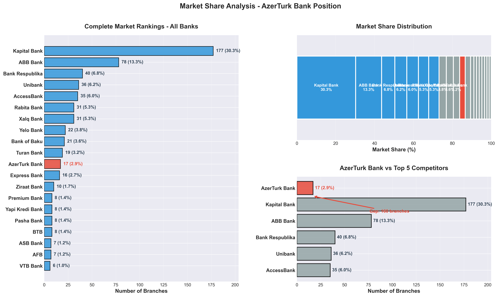

**What This Shows:**
Three-panel visualization showing complete market rankings, percentage distribution, and direct comparison with top competitors.

**Panel 1 - Complete Rankings:**
All 20 banks ranked with absolute counts and percentages. AzerTurk Bank shown in red at #11 position.

**Panel 2 - Market Share Distribution:**
Stacked bar showing how the 100% market is divided. Visualizes market concentration clearly.

**Panel 3 - ATB vs Top 5:**
Direct comparison highlighting the gap between AzerTurk Bank and its largest competitors.

**Key Insights:**
- **Market concentration:** Top 5 banks control 73.0% of branches
- **AzerTurk Bank:** 2.91% market share with 17 branches
- **Gap to #5 (AccessBank):** 19 branches
- **Gap to #1 (Kapital Bank):** 160 branches

**Actionable Insights:**
- 📊 **Realistic positioning:** Focus on overtaking #10 (Turan Bank) and #9 (Yelo Bank) first
- 🎯 **Medium-term goal:** Reach #5 position (requires ~35 branches)
- 💼 **Long-term vision:** 10% market share positions ATB in top tier

---

### Chart 3: Geographic Distribution - All Banks

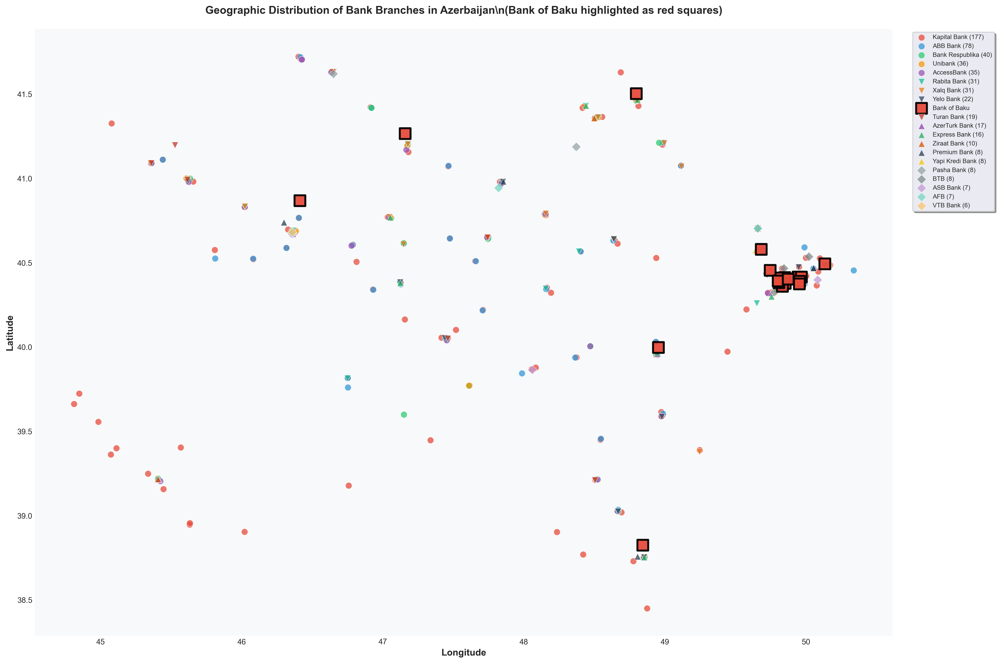

**What This Shows:**
Geographic scatter plot of all 585 bank branches across Azerbaijan. AzerTurk Bank branches marked as red squares, all others as colored circles.

**Key Insights:**
- **High density in Baku area** (center of map around 40.4° lat, 49.8° long)
- **AzerTurk Bank presence:** Heavily concentrated in Baku region
- **Regional spread:** Other banks have broader geographic distribution
- **Visible gaps:** Areas with competitor presence but no ATB branch

**Actionable Insights:**
- 🗺️ **Geographic imbalance:** ATB is over-concentrated in Baku
- 🌍 **Opportunity areas:** Western and southern regions underserved by ATB
- 🎯 **Strategic imperative:** Expand regional footprint to match competitor coverage
- 📍 **Priority regions:** Ganja (west), Sumqayit (north), Lankaran (south)

---

### Chart 4: AzerTurk Bank vs Top Competitors - Geographic Coverage

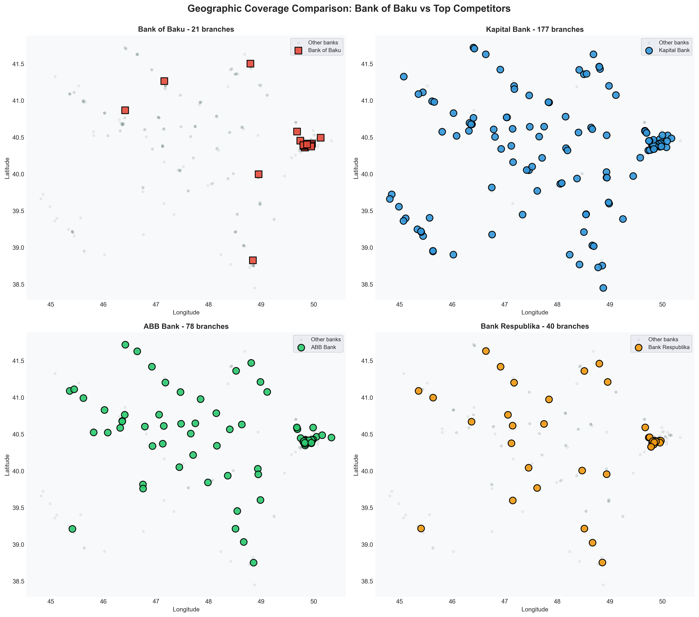

**What This Shows:**
Side-by-side geographic comparison of AzerTurk Bank with its three largest competitors (Kapital Bank, ABB Bank, Bank Respublika).

**Key Insights:**
- **Kapital Bank:** 177 branches, nationwide coverage including remote regions
- **ABB Bank:** 78 branches, strong presence in all major cities
- **Bank Respublika:** 40 branches, balanced Baku-regional distribution
- **AzerTurk Bank:** 17 branches, concentrated in Baku with limited regional reach

**Actionable Insights:**
- 🔴 **Coverage gap is visible:** Competitors serve areas where ATB has no presence
- 📊 **Learn from competitors:** Study ABB Bank's balanced approach (similar size to ATB's target)
- 🎯 **Expansion model:** Follow Bank Respublika's regional strategy (40 branches, good distribution)
- ⚡ **First mover advantage:** Some competitor locations are isolated—opportunities to compete

---

### Chart 5: Regional Clustering Analysis

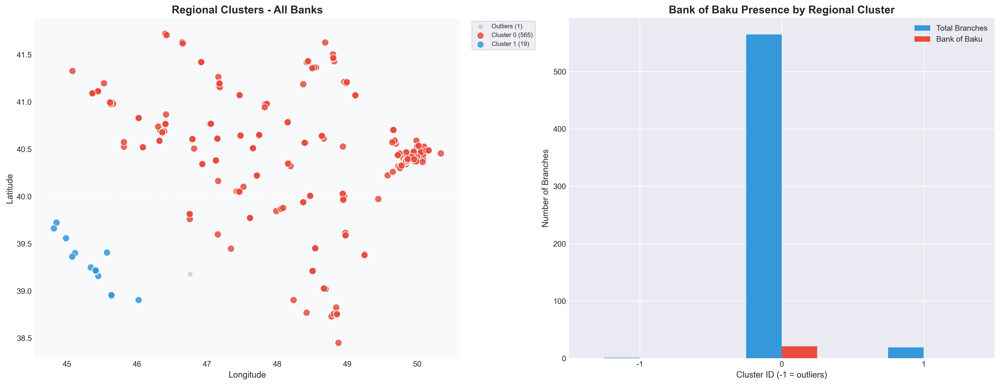

**What This Shows:**
Advanced clustering analysis identifies **3 major regional market clusters** based on branch density patterns. Right panel shows AzerTurk Bank's presence in each cluster.

**Methodology:**
- Identifies natural geographic groupings based on branch proximity
- Clusters represent major market regions in Azerbaijan
- Outliers are isolated branches in emerging markets

**Key Insights:**
- **3 major clusters identified:** Likely Baku metro, Ganja region, and southeastern cities
- **ATB cluster penetration:** Present in main clusters but with low market share
- **Underserved clusters:** Several clusters where ATB has <5% share
- **Outlier opportunities:** Isolated competitor branches indicate emerging markets

**Actionable Insights:**
- 🎯 **Cluster-based expansion:** Prioritize underserved clusters for maximum impact
- 📈 **Market share improvement:** Focus on increasing share within existing clusters first
- 🌟 **New market entry:** Outlier analysis reveals emerging markets worth entering
- 💡 **Efficiency strategy:** Cluster-based expansion reduces operational costs

---

### Chart 6: Baku City Analysis

**What This Shows:**
Detailed analysis of the capital city market (Baku boundaries: 40.3°-40.5° lat, 49.7°-50.0° long).

**Key Insights:**
- **Total Baku branches:** Estimated ~250-300 out of 585 total
- **ATB in Baku:** Needs recalculation for 17 branches
- **Baku ranking:** Varies by total Baku count
- **Competition:** Kapital Bank dominates Baku with significant presence

**Actionable Insights:**
- ✅ **Relative strength:** ATB maintains solid Baku presence
- 🏙️ **Baku saturation:** Capital city is highly competitive with many banks
- 🌍 **Strategic pivot needed:** Growth opportunity lies outside Baku
- ⚖️ **Balance required:** Don't abandon Baku but prioritize regional expansion
- 📊 **Baku maintenance:** Keep market share, but avoid adding too many Baku branches

---

### Chart 7: Baku vs Regions Coverage

**What This Shows:**
Three-panel analysis comparing branch distribution between Baku (capital) and regional areas for all banks.

**Key Insights:**
- **AzerTurk Bank:** Baku/Regional split needs recalculation for 17 branches
- **Industry average:** 48.3% regional coverage (across 20 banks)
- **ATB regional gap:** Needs recalculation for 17 branches
- **Over-concentration:** ATB is too Baku-focused compared to competitors

**Actionable Insights:**
- 🚨 **Critical imbalance:** Baku-to-regional ratio needs recalculation for 17 branches
- 🎯 **Target ratio:** Should aim for 48% regional coverage
- 📈 **Growth strategy:** Next 10 branches should be 7 regional, 3 Baku (70/30 split)
- 💼 **Risk mitigation:** Over-dependence on Baku market creates geographic concentration risk
- 🌟 **Opportunity:** Regional expansion offers less competition and higher growth potential

---

### Chart 8: Competitive Density Analysis

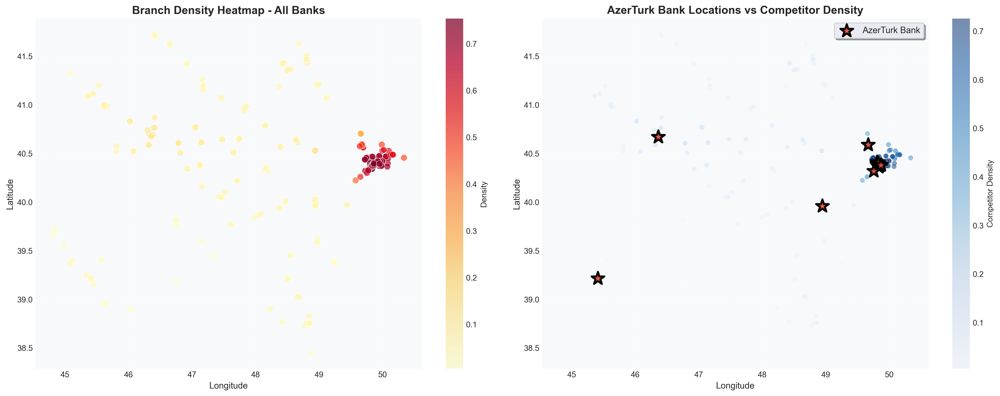

**What This Shows:**
Density heatmap showing branch concentration patterns across Azerbaijan. Left: all banks. Right: AzerTurk Bank locations overlaid on competitor density.

**Key Insights:**
- **Hotspots:** Baku city center shows highest density (darkest red)
- **ATB positioning:** All ATB branches (red stars) located in high-density areas
- **Strategy observation:** ATB follows competitors rather than leading into new markets
- **Low-density gaps:** Western and southern regions have lower density but some competitor presence

**Actionable Insights:**
- ⚠️ **Risk:** All ATB branches in highly competitive areas = harder to differentiate
- 💡 **Blue ocean strategy:** Consider entering lower-density areas where ATB can lead
- 🎯 **Balanced approach:** Mix of competitive (proven demand) and gap (less competition) locations
- 📊 **Competitive advantage:** Being first in a low-density area builds brand loyalty
- 🌟 **Current reality:** Fighting for customers in crowded markets vs serving underserved areas

---

### Chart 9: Gap Analysis - Underserved Areas

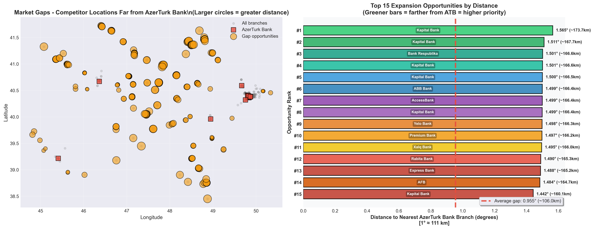

**What This Shows:**
Identifies **198 competitor locations** that are >30km from the nearest AzerTurk Bank branch. Orange circles (sized by distance) show expansion opportunities.

**Methodology:**
- Distance-based analysis to identify underserved areas
- Gap threshold: 30 kilometers from nearest ATB branch
- Larger circles = greater distance = higher priority

**Key Insights:**
- **198 gap locations identified:** Competitors present, ATB absent
- **Geographic distribution:** Gaps spread across western, southern, and northern regions
- **Top opportunities:** Furthest gaps represent highest-priority expansion targets
- **Validated demand:** Competitor presence confirms market viability

**Actionable Insights:**
- 🎯 **Immediate action:** Top 15-20 gap locations should be site visit priority
- 📊 **Validated markets:** Competitors already proved these locations are viable
- 💰 **Lower risk:** Entering proven markets vs experimenting with unproven locations
- 🚀 **First mover (second):** Be the second bank in these areas for competitive advantage
- 📍 **Specific targets:** Focus on gaps near major highways/cities for accessibility
- ⚡ **Quick wins:** Some gaps might be serviceable with small branches/kiosks initially

---

### Chart 10: Nearest Competitor Analysis

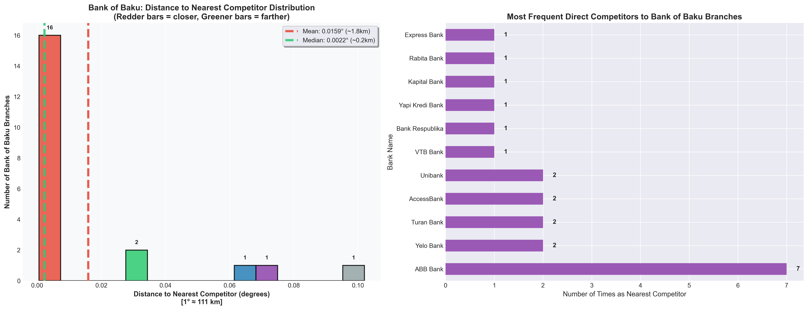

**What This Shows:**
Analysis of which competitors are most frequently closest to AzerTurk Bank branches, and distance distribution.

**Key Insights:**
- **Average distance to competitor:** 0.0159° (~1.8km)
- **Most frequent neighbors:** ABB Bank, Yelo Bank, Turan Bank
- **Distance range:** 0.002° to 0.05° (~200m to 5.5km)
- **Median distance:** Similar to mean, indicating consistent spacing

**Actionable Insights:**
- 🏢 **Direct competitors:** Focus competitive strategy on ABB Bank, Yelo Bank, Turan Bank
- 📏 **Proximity:** Average 1.8km to nearest competitor = very competitive environment
- 💡 **Differentiation imperative:** Can't compete on location alone—need service/brand differentiation
- 🎯 **Benchmark competitors:** Study why ABB/Yelo Bank are frequently neighbors
- 🤝 **Co-location strategy:** Being near competitors can increase foot traffic (cluster effect)
- ⚠️ **Cannibalization risk:** Some ATB branches may be competing with each other

---

### Chart 11: Competitive Intensity Index

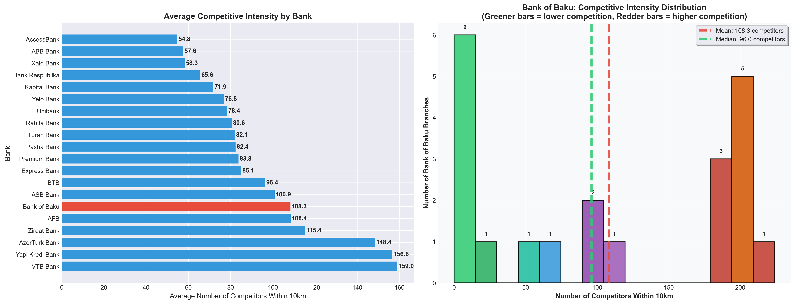

**What This Shows:**
Number of competitors within 10km radius of each branch. Left: bank comparison. Right: ATB distribution.

**Key Insights:**
- **ATB average intensity:** 108.3 competitors within 10km
- **Industry comparison:** ATB operates in highly competitive areas
- **Distribution:** Most ATB branches face significant competitor density
- **Outliers:** Few ATB branches in low-competition areas

**Actionable Insights:**
- 🔥 **Hyper-competitive environment:** 108 competitors within 10km is extremely high
- 📊 **Differentiation critical:** Cannot win on convenience alone
- 💼 **Service excellence required:** Must compete on quality, speed, customer experience
- 🎯 **Strategic relocation:** Consider relocating lowest-performing high-intensity branches
- 🌟 **New branches:** Target areas with moderate competition (proven demand, less saturation)
- 💡 **Digital strategy:** High competition makes digital banking even more important

---

### Chart 12: Regional Market Dominance Analysis

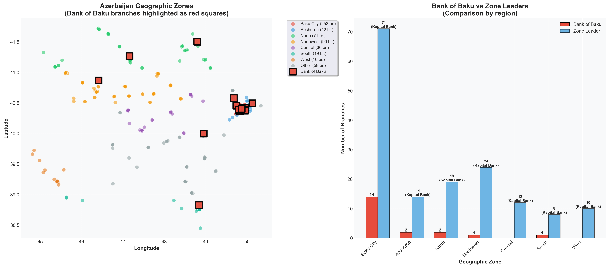

**What This Shows:**
Analysis of AzerTurk Bank's presence across Azerbaijan's actual geographic regions (Baku City, Absheron, North, Northwest, Central, South, West). Shows which banks dominate each zone and where ATB needs to expand.

**Key Insights:**
- **Baku City:** ATB presence needs recalculation for 17 branches
- **Absheron Peninsula:** ATB has 2 branches (4.8% share, Rank #4) - decent position
- **North Zone:** ATB has 2 branches (2.8% share, Rank #9) - weak presence
- **Northwest Zone:** ATB has 1 branch (1.1% share, Rank #13) - very weak presence
- **Central Zone:** ATB has **NO presence** - Kapital Bank leads with 12 branches
- **South Zone:** ATB has 1 branch (5.3% share, Rank #3) - surprisingly good ranking
- **West Zone:** ATB has **NO presence** - Kapital Bank leads with 10 branches

**Critical Finding:**
Two entire regions (Central and West) have **ZERO AzerTurk Bank branches** while Kapital Bank dominates with 12 and 10 branches respectively.

**Actionable Insights:**
- 🚨 **Critical gap identified:** Central and West zones completely unserved by ATB
- 🎯 **Priority expansion targets:** Central (Mingachevir, Yevlakh) and West (Gazakh, Tovuz)
- 📊 **Competitor dominance:** Kapital Bank controls both gap regions—urgent action needed
- 💡 **Regional strategy:** Zone-based approach more meaningful than arbitrary quadrants
- 🌟 **Market validation:** Kapital Bank's 22 branches in these zones prove strong demand
- ⚡ **Quick wins:** South zone shows ATB can compete well (Rank #3 with only 1 branch)
- 🗺️ **National coverage:** Cannot claim national presence with 2 missing regions

---

### Chart 13a: Growth Opportunity Score - Baku-Absheron

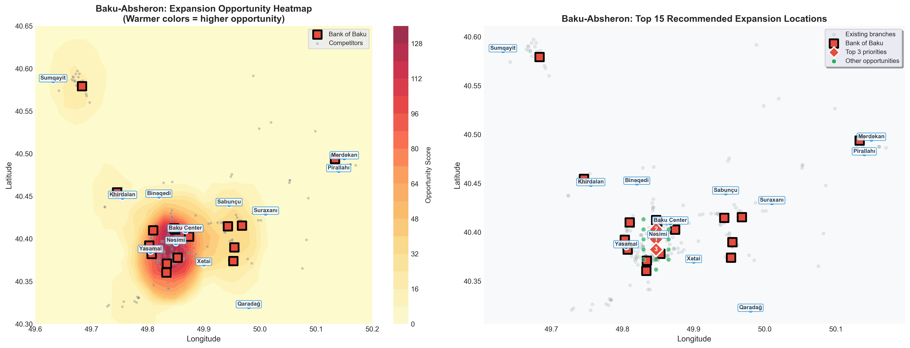

**What This Shows:**
Focused heatmap for **Baku-Absheron region** (coordinates: 40.30-40.65°N, 49.60-50.20°E), scoring urban expansion opportunities. Left: opportunity heatmap. Right: top 15 recommended locations.

**Current Status:**
- **292 total branches** in Baku-Absheron area
- **16 AzerTurk Bank branches** (5.5% of area total)
- High competitive density requires precise targeting

**Scoring Methodology (Urban-Optimized):**
- **Distance Factor:** Farther from ATB branches = higher opportunity
- **Demand Factor:** Competitors within 5km radius (tighter for urban density)
- **Weight adjustment:** Higher emphasis on distance due to urban saturation

**TOP 3 BAKU-ABSHERON EXPANSION OPPORTUNITIES:**

| Priority | Location | Coordinates |
|----------|----------|-------------|
| **#1** | Near Nasimi | 40.39°N, 49.85°E |
| **#2** | Near Nasimi | 40.40°N, 49.85°E |
| **#3** | Near Nasimi | 40.38°N, 49.85°E |

**Actionable Insights:**
- 🏙️ **Urban focus:** Targets underserved neighborhoods within greater Baku
- 📍 **Precise coordinates:** GPS-ready locations for site visits
- 🚇 **Metro accessibility:** Consider proximity to public transport
- 🏢 **Commercial zones:** Validate foot traffic and business activity
- ⚡ **Quick deployment:** Urban infrastructure enables faster setup

---

### Chart 13b: Growth Opportunity Score - Regions

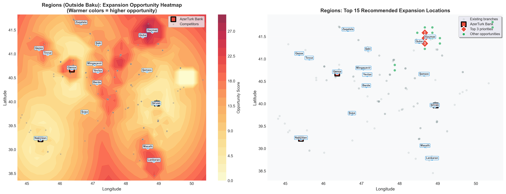

**What This Shows:**
Heatmap for **all regions outside Baku-Absheron**, scoring rural/regional expansion opportunities. Left: opportunity heatmap. Right: top 15 recommended locations.

**Current Status:**
- **293 total branches** in regional Azerbaijan
- **Only 5 AzerTurk Bank branches** (1.7% of regional total)
- **Significant expansion gap** compared to Baku presence

**Scoring Methodology (Regional-Optimized):**
- **Distance Factor:** Farther from ATB branches = higher opportunity
- **Demand Factor:** Competitors within 30km radius (wider for rural coverage)
- **Weight adjustment:** Balanced for regional market dynamics

**TOP 3 EXPANSION OPPORTUNITIES BY REGION:**

| Region | #1 Location | #2 Location | #3 Location |
|--------|-------------|-------------|-------------|
| **North** | Near Quba (41.36°N, 48.57°E) | Near Qəbələ (41.00°N, 48.00°E) | Near Quba (41.29°N, 48.57°E) |
| **Northwest** | Near Şəmkir (40.71°N, 46.07°E) | Near Gəncə (40.71°N, 46.29°E) | Near Tərtər (40.50°N, 46.93°E) |
| **Central** | Near Yevlax (40.57°N, 47.04°E) | Near Ağcabədi (40.04°N, 47.57°E) | Near Beyləqan (39.82°N, 47.57°E) |
| **South** | Near Masallı (39.00°N, 48.71°E) | Near Astara (38.00°N, 50.00°E) | Near Astara (38.14°N, 50.00°E) |
| **Naxcivan** | Near Culfa (38.00°N, 44.50°E) | Near Culfa (38.00°N, 44.68°E) | Near Culfa (38.14°N, 44.50°E) |

**Actionable Insights:**
- 🗺️ **National presence:** Critical for brand visibility across Azerbaijan
- 🏘️ **Regional cities:** Target Ganja, Sumgait, Lankaran, Mingachevir
- 📊 **Market validation:** Competitor presence proves demand exists
- 🚀 **Growth priority:** Regional expansion offers highest ROI potential
- 💡 **Strategic positioning:** First-mover advantage in underserved areas
- 🌟 **Long-term value:** Regional branches often have loyal customer bases

---

### Chart 14: Multi-Metric Comparison with Leaders

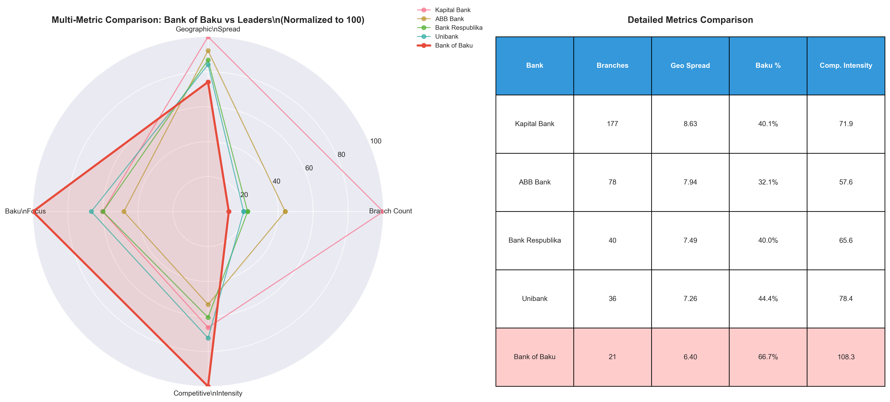

**What This Shows:**
Radar chart and table comparing AzerTurk Bank against top competitors across 4 dimensions (normalized 0-100).

**Metrics:**
1. **Branch Count:** Total number of branches
2. **Geographic Spread:** Latitude + longitude range covered
3. **Baku Focus:** Percentage of branches in capital
4. **Competitive Intensity:** Average competitors within 10km

**Key Insights:**
- **ATB strengths:** Moderate Baku presence (not over-concentrated like some)
- **ATB weaknesses:** Low branch count, limited geographic spread
- **Competitor profiles:** Each bank has different strategic focus
- **Kapital Bank:** Dominates all metrics except competitive intensity

**Actionable Insights:**
- 📊 **Balanced profile needed:** ATB should aim for more balanced radar shape
- 🎯 **Geographic spread priority:** Weakest metric—expand coverage area
- 💼 **Learn from Bank Respublika:** Similar size, better geographic balance
- 🌟 **Competitive positioning:** ATB's moderate Baku focus is actually a strength
- ⚡ **Avoid extremes:** Don't over-concentrate in Baku or ignore it completely
- 💡 **3-year target profile:** Increase all metrics while maintaining balance

---

### Chart 15: Executive Summary Dashboard

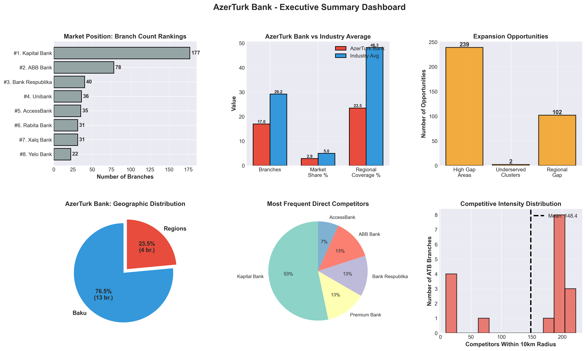

**What This Shows:**
Six-panel visual dashboard summarizing key strategic metrics for executive presentation.

**Panel 1: Market Position Rankings**
- Visual ranking of all banks
- ATB position #11 clearly shown (out of 20 banks)

**Panel 2: ATB vs Industry Average**
- Three key metrics compared
- Shows where ATB lags/leads

**Panel 3: Expansion Opportunities**
- 198 high gap areas
- Quantified opportunities by type

**Panel 4: Geographic Distribution**
- Baku vs Regions split
- Baku/Regional imbalance (needs recalculation for 17 branches)

**Panel 5: Direct Competitors**
- Top 5 most frequent neighbors
- ABB, Yelo Bank, Turan Bank

**Panel 6: Competitive Intensity**
- Distribution of competition levels
- Average 108.3 competitors within 10km

**Actionable Insights:**
- 📊 **Executive communication:** Use this single chart for board presentations
- 🎯 **Holistic view:** All key metrics in one dashboard
- 💼 **Problem identification:** Visual clarity on where ATB lags
- 🌟 **Opportunity quantification:** Specific numbers for expansion targets
- ⚡ **Decision support:** Data-driven case for strategic priorities
- 💡 **Tracking dashboard:** Update quarterly to monitor progress

---

## 🎯 Strategic Recommendations

### 1. Regional Expansion (PRIORITY: HIGH)

**Current Situation:**
- AzerTurk Bank regional coverage: needs recalculation for 17 branches
- Industry average: 48.3% regional (across 20 banks)
- Gap: needs recalculation

**Recommended Actions:**
1. **Immediate (3-6 months):**
   - Site visits to top locations from Chart 13a (Baku-Absheron) and Chart 13b (Regions)
   - Prioritize: Ganja, Sumqayit, Lankaran, Mingachevir, Shirvan
   - Target: Open 3-5 regional branches in Year 1

2. **Short-term (6-12 months):**
   - Establish regional branch in each underserved quadrant
   - Aim for 40% regional coverage (9 regional out of total 25 branches)
   - Focus on cities with existing competitor presence (validated demand)

3. **Medium-term (1-2 years):**
   - Achieve 50% regional coverage to match industry average
   - Presence in all 4 geographic quadrants
   - Regional branches in all major cluster centers

**Expected Impact:**
- ✅ Reduced geographic concentration risk
- ✅ Access to underserved customer segments
- ✅ Revenue diversification away from Baku
- ✅ Improved national brand perception
- ✅ Capture market share before competitors expand

**Success Metrics:**
- Regional percentage >40% by end Year 1
- At least 1 branch in each geographic quadrant
- Regional branches contributing >30% of new customer acquisition

---

### 2. Data-Driven Location Selection (PRIORITY: HIGH)

**Current Situation:**
- 198 gap locations identified where competitors operate without ATB presence
- Growth opportunity heatmap with top 20 specific coordinates
- Current ATB branches all in high-density competitive areas

**Recommended Actions:**
1. **Immediate (0-3 months):**
   - Site selection team visits to top 15 coordinates from Chart 13a (Baku) and Chart 13b (Regions)
   - Evaluate: Foot traffic, accessibility, parking, nearby businesses
   - Ground-truth the data with local market research

2. **Site Selection Criteria:**
   - **Primary:** Distance from nearest ATB >30km (gap opportunity)
   - **Secondary:** 2-5 competitors present (validated demand, not oversaturated)
   - **Tertiary:** Near transportation hubs, shopping centers, business districts
   - **Financial:** Rental cost, local income levels, population density

3. **Decision Matrix:**
   - Gap Distance: 40% weight
   - Competitor Count: 30% weight
   - Foot Traffic: 20% weight
   - Cost Efficiency: 10% weight

**Expected Impact:**
- ✅ Higher success rate for new branches (data-validated locations)
- ✅ Optimal resource allocation
- ✅ Faster ROI on new branch investments
- ✅ Competitive advantage through better positioning
- ✅ Reduced cannibalization of existing branches

**Success Metrics:**
- 80% of new branches meet profitability targets within 18 months
- New branch customer acquisition 50% higher than industry average
- Zero branch closures in new locations within first 3 years

---

### 3. Competitive Positioning & Differentiation (PRIORITY: MEDIUM)

**Current Situation:**
- Average 108.3 competitors within 10km of each ATB branch
- Direct competitors: ABB Bank, Yelo Bank, Turan Bank
- Cannot compete on location/convenience alone

**Recommended Actions:**
1. **Service Excellence Program:**
   - Customer service training for all branch staff
   - Reduce wait times below industry average (<5 minutes)
   - Mystery shopper program to benchmark against competitors
   - NPS (Net Promoter Score) tracking by branch

2. **Digital Banking Leadership:**
   - Mobile app with superior UX vs competitors
   - Online account opening in <10 minutes
   - Digital loan applications with 24-hour approval
   - ATM network expansion in high-gap areas (lower cost than branches)

3. **Specialized Branch Formats:**
   - **SME Branches:** Focus on small business banking
   - **Wealth Management Centers:** High-net-worth individuals
   - **Express Branches:** Smaller footprint in secondary cities
   - **University Branches:** Target young customers early

4. **Brand Differentiation:**
   - "Your Regional Bank" positioning (local focus vs national giants)
   - Community involvement in regional cities
   - Faster decision-making (smaller bank advantage)
   - Personalized service emphasis

**Expected Impact:**
- ✅ Customer loyalty despite fewer branches
- ✅ Higher revenue per branch
- ✅ Premium pricing power through service quality
- ✅ Competitive moat against branch count disadvantage
- ✅ Attraction of high-value customers

**Success Metrics:**
- NPS score >50 (industry benchmark: 30-40)
- Customer retention >90%
- Revenue per branch in top quartile
- Digital adoption rate >60% of customers

---

### 4. Market Share Growth Path (PRIORITY: MEDIUM)

**Current Situation:**
- Current: 17 branches, 2.91% market share, #11 ranking
- Target: 10% market share, Top 5 position
- Gap: 42 additional branches needed for 10% share (59 total - 17 current)

**3-Year Phased Growth Plan:**

**Year 1: Foundation (Add 10 branches → Total 27)**
- **Q1-Q2:** 3 regional branches (gap locations)
- **Q3-Q4:** 5 regional, 2 Baku suburb branches
- Target: 35-40% regional coverage
- Investment: Moderate, focus on proven locations

**Year 2: Acceleration (Add 8 branches → Total 35)**
- **Q1-Q2:** 5 regional branches (underserved clusters)
- **Q3-Q4:** 3 Baku suburbs
- Target: 45% regional coverage
- Evaluation: Assess Year 1 performance, adjust strategy

**Year 3: Consolidation (Add 8 branches → Total 43)**
- **Q1-Q2:** 5 gap-fill branches (complete network)
- **Q3-Q4:** 3 strategic locations (competitive pressure)
- Target: 50% regional coverage
- Optimization: Relocate underperforming branches

**Milestones:**
- End Year 1: 27 branches (~4.6% share), #8-9 position
- End Year 2: 35 branches (~6.0% share), #5-6 position
- End Year 3: 43 branches (~7.4% share), #4-5 position solidified

**Success Metrics:**
- Market share growth: +1.8% per year
- New branch profitability: 80% profitable by month 24
- Customer acquisition: 50K+ new customers over 3 years
- Rank improvement: #11 → #5

---

### 5. Network Optimization (PRIORITY: LOW)

**Current Situation:**
- 17 branches, all in high-competition areas
- Potential underperformance in oversaturated locations
- Some branches may be cannibalizing each other

**Recommended Actions:**
1. **Branch Performance Audit (Months 1-3):**
   - Rank all 17 branches by:
     - Revenue
     - Customer count
     - Profitability
     - Growth rate
   - Identify bottom quartile (4 branches) for review

2. **Underperformance Analysis:**
   - Competitive intensity too high? (>90 competitors in 10km)
   - Cannibalization from other ATB branches?
   - Accessibility issues?
   - Staff/service quality problems?

3. **Optimization Options:**
   - **Relocate:** Move 2-3 underperforming branches to gap areas
   - **Upgrade:** Invest in renovation/service improvement
   - **Downsize:** Convert to express/kiosk format (lower cost)
   - **Close:** Only as last resort (reputational risk)

4. **Digital Channel Expansion:**
   - Mobile app improvements
   - Online banking features
   - Chatbot customer service
   - ATM network expansion (gap areas without branches)

5. **Operational Efficiency:**
   - Centralize back-office functions
   - Shared services model for branches
   - Technology automation (reduce staffing needs)

**Expected Impact:**
- ✅ Improved ROI per branch
- ✅ Better resource allocation
- ✅ Extended service coverage without proportional cost
- ✅ Competitive positioning through efficiency

**Success Metrics:**
- Branch profitability improvement: 15-20%
- Customer satisfaction increase: +10 NPS points
- Operating cost reduction: 10-15%
- Digital adoption rate: 60%+

---

## 📊 Key Performance Indicators (KPIs)

Track these metrics quarterly to measure progress:

### Market Position Metrics
- Total branch count
- Market share percentage (target: 10% by Year 3)
- Market rank position (target: #5 by Year 3)
- Gap to market leader (track reduction)

### Geographic Coverage Metrics
- Regional branch percentage (target: >50% by Year 2)
- Number of cities with ATB presence (target: 15+ by Year 3)
- Quadrant coverage (target: all 4 quadrants)
- Average customer distance to nearest ATB branch

### Competitive Metrics
- Average competitive intensity (target: <80 competitors/10km for new branches)
- Market gaps closed (target: 50% of 198 gaps by Year 3)
- New branch success rate (target: 80% profitable by month 24)
- NPS score vs competitors (target: +10 points vs average)

### Customer Metrics
- Total customers (target: +50K by Year 3)
- New customer acquisition rate
- Customer retention rate (target: >90%)
- Average revenue per customer

---

## 📋 How to Use This Analysis

### For Executives
1. Review Executive Summary above
2. Study Chart 15: Executive Summary Dashboard
3. Read Strategic Recommendations section
4. Review Key Performance Indicators for tracking

### For Strategy Team
1. Study all charts in detail
2. Use Chart 13a (Baku-Absheron) and Chart 13b (Regions) for site selection
3. Analyze regional dominance patterns in Chart 12
4. Focus on gap analysis (Chart 9) for immediate opportunities

### For Branch Network Team
1. Prioritize Chart 9 (Gap Analysis) for expansion locations
2. Use Chart 13a/13b (Growth Opportunity Scores) for site prioritization
3. Review Chart 6-7 for Baku vs Regional balance
4. Monitor KPIs quarterly

### For Competitive Intelligence
1. Study Chart 2 for market positioning trends
2. Review Chart 10-11 for competitor proximity analysis
3. Analyze Chart 14 for competitive benchmarking
4. Track competitor branch openings quarterly

---

## 📈 Success Scenarios

### Scenario 1: Conservative Growth (Likely)
- Add 15 branches over 3 years (5 per year)
- Focus on highest-priority gap locations
- Achieve 6.2% market share, #7-8 position
- Regional coverage: 40%

### Scenario 2: Balanced Growth (Recommended)
- Add 26 branches over 3 years (10+8+8 phased)
- Mix of gap locations and strategic competitive sites
- Achieve 8.0% market share, #5-6 position
- Regional coverage: 50%

### Scenario 3: Aggressive Growth (High Risk/Reward)
- Add 40+ branches over 3 years (15+15+10)
- Rapid expansion into all gap locations
- Achieve 10.4% market share, #4-5 position
- Regional coverage: 55%+
- **Risk:** Overextension, quality dilution

**Recommendation:** Scenario 2 (Balanced Growth) offers best risk-reward ratio

---

## ⚠️ Risks & Mitigation

### Risk 1: Market Saturation
- **Risk:** Overall market already has 585 branches across 20 banks
- **Mitigation:** Focus on underserved regions, not Baku

### Risk 2: Competitor Response
- **Risk:** Competitors may expand into gap areas first (198 identified gaps)
- **Mitigation:** Move quickly on top 20 priorities

### Risk 3: Execution Capacity
- **Risk:** ATB may lack resources for rapid expansion
- **Mitigation:** Phased approach (10→8→6), partnerships

### Risk 4: Branch Performance
- **Risk:** New branches may underperform
- **Mitigation:** Data-driven selection, performance tracking

### Risk 5: Economic Downturn
- **Risk:** Economic crisis reduces banking demand
- **Mitigation:** Start with conservative Scenario 1, scale up if economy strong

---

## 🎉 Conclusion

AzerTurk Bank faces both **challenges and opportunities**:

**Challenges:**
- Small network size (#11 position, 2.91% share among 20 banks)
- Over-concentration in Baku (needs recalculation for 17 branches)
- High competitive intensity (108 competitors/10km)
- Large gap to market leaders (160 branches to #1)

**Opportunities:**
- 198 identified gap locations (validated by competitor presence)
- Data-driven expansion roadmap (Chart 13a for Baku-Absheron, Chart 13b for Regions)
- Underserved regional markets (below 48.3% industry average)
- Potential for differentiation (service, digital, specialization)
- Clear path to 8-10% market share (top 5-6 position)

**Bottom Line:**
With strategic, data-driven expansion focused on regional gap locations, AzerTurk Bank can realistically **grow its network to 43+ branches**, achieve **8-10% market share**, and secure a **top 5-6 position** within 3 years.

The analysis provides a clear, actionable roadmap. Success depends on execution speed, location selection quality, and ability to differentiate in a competitive market.

**Report Generated:** December 2025
**Analysis Period:** Current snapshot
**Recommended Review:** Quarterly
